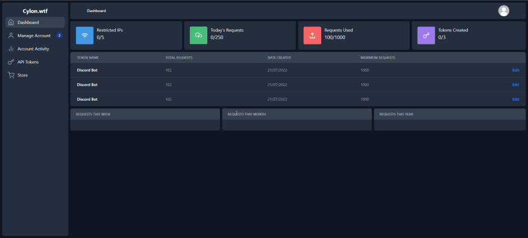
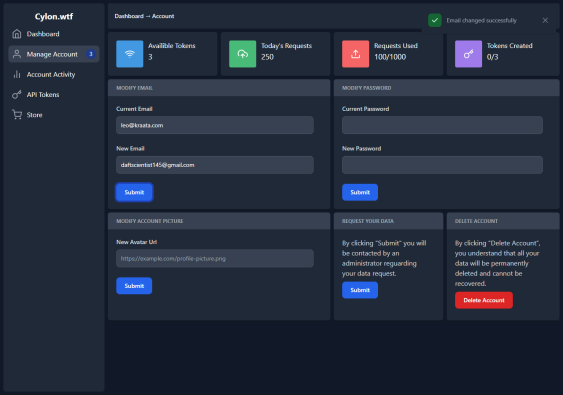
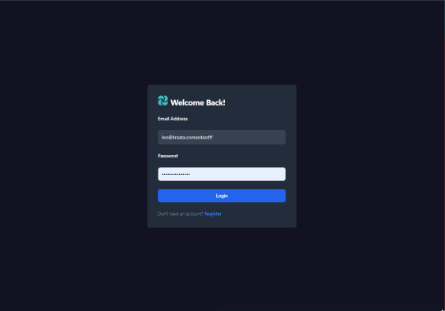
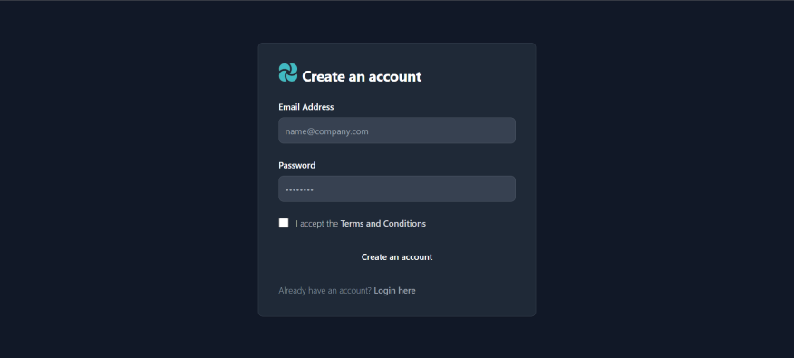

Based on the information from the repository and the context provided, here is an updated `README.md` for your project, Cylon:

---

# Cylon

Cylon is a powerful and user-friendly web UI dashboard designed for an API that specializes in image generation and manipulation. Built with React.js, Axios, and TailwindCSS, Cylon provides an intuitive interface for managing API tokens, tracking usage, and more.

## Features

- **Dashboard Overview**: Get a quick summary of your API usage, including today's requests, total requests, and tokens created.
  

- **Account Management**: Easily update your account details, change your password, or request account deletion.
  

- **Authentication**: Secure login interface to protect your account and API access.
  

## Technologies Used

- **React.js**: A JavaScript library for building user interfaces.
- **Axios**: Promise-based HTTP client for making API requests.
- **TailwindCSS**: A utility-first CSS framework for styling the frontend.

## Project Structure

- **src/components**: Contains React components for the dashboard, account management, and login screens.
- **src/services**: Axios configurations and API service functions.
- **src/styles**: TailwindCSS configurations and custom styles.

## Getting Started

To start using Cylon, follow these steps:

1. **Clone the repository**:
   ```bash
   git clone https://github.com/Daftscientist/Cylon-B1-V2-API-Frontend.git
   cd Cylon-B1-V2-API-Frontend
   ```

2. **Install dependencies**:
   ```bash
   npm install
   ```

3. **Run the development server**:
   ```bash
   npm start
   ```

   The application will be available at `http://localhost:3000`.

## Screenshots

### Dashboard Overview


### Manage Account


### Error Toasts


### Login Screen


## About

Cylon is designed to make it easy for developers to interact with image generation and manipulation APIs. The clean and responsive interface ensures a seamless experience whether you are managing your tokens or tracking API usage.

For more information, read the [projects code](pages)
